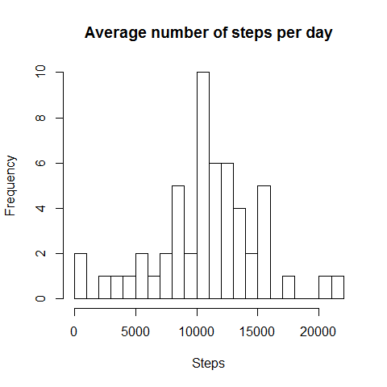
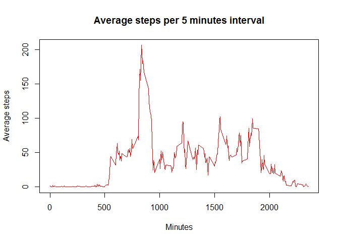
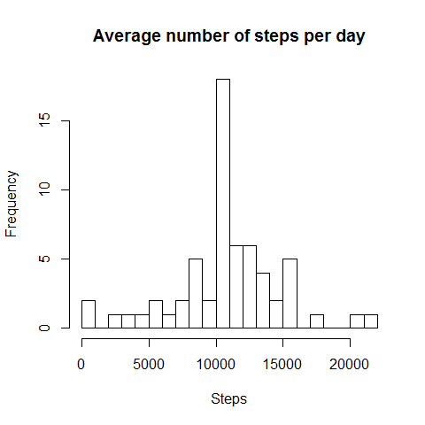
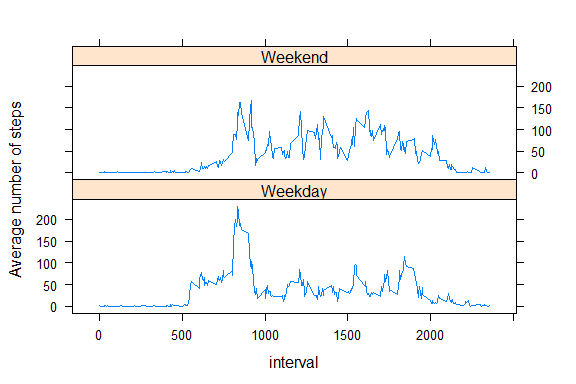

# Reproducible Research: Peer Assessment 1


## Loading and preprocessing the data

1. Load the data.
It is assumed that the activity.csv file is in the activity folder in the current directory.

```r
activity <- read.csv("./activity/activity.csv")
dim(activity)
```

```
## [1] 17568     3
```
2. Process/transform the data.
Identify class of variables in the data

```r
str(activity)
```

```
## 'data.frame':	17568 obs. of  3 variables:
##  $ steps   : int  NA NA NA NA NA NA NA NA NA NA ...
##  $ date    : Factor w/ 61 levels "2012-10-01","2012-10-02",..: 1 1 1 1 1 1 1 1 1 1 ...
##  $ interval: int  0 5 10 15 20 25 30 35 40 45 ...
```
3. Convert class of date variable to "Date" and "steps & interval" variable to numeric.

```r
activity$date <- as.Date(activity$date)
activity$steps <- as.numeric(activity$steps)
activity$interval <- as.numeric(activity$interval)
str(activity)
```

```
## 'data.frame':	17568 obs. of  3 variables:
##  $ steps   : num  NA NA NA NA NA NA NA NA NA NA ...
##  $ date    : Date, format: "2012-10-01" "2012-10-01" ...
##  $ interval: num  0 5 10 15 20 25 30 35 40 45 ...
```


## What is mean total number of steps taken per day?
1. Make a histogram of the total number of steps taken each day.


```r
# Summarize number of steps per day
activityDay <- aggregate(steps ~ date, data=activity, FUN= sum)

# Plot the histogram
hist(activityDay$steps, xlab="Steps", main="Average number of steps per day", breaks = 20)
```

 

2. Calculate and report the mean and median total number of steps taken per day.

```r
# Mean total number of steps taken per day
old_mean <- mean(activityDay$steps)
print(old_mean)
```

```
## [1] 10766.19
```

```r
# Median total number of steps taken per day
old_median <- median(activityDay$steps)
print(old_median)
```

```
## [1] 10765
```

## What is the average daily activity pattern?
1. Make a time series plot (i.e. type = "l") of the 5-minute interval (x-axis) and the average number of steps taken, averaged across all days (y-axis).

```r
# Summarize mean number of steps per interval
activityInterval <- aggregate(steps ~ interval, data=activity, FUN= mean)
plot(activityInterval$interval, activityInterval$steps, type="l", xlab="Minutes", ylab="Average steps", main="Average steps per 5 minutes interval", col="red")
```

 

2. Which 5-minute interval, on average across all the days in the dataset, contains the maximum number of steps?

```r
activityInterval[activityInterval$steps == max(activityInterval$steps),]$interval
```

```
## [1] 835
```

## Imputing missing values
1. Calculate and report the total number of missing values in the dataset.

```r
# Identify which variable contains missing values
if(any(is.na(activity$steps))) print("steps has NA values") else print("steps has no NA values")
```

```
## [1] "steps has NA values"
```

```r
if(any(is.na(activity$date))) print("date has NA values") else print("date has no NA values")
```

```
## [1] "date has no NA values"
```

```r
if(any(is.na(activity$interval))) print("interval has NA values") else print("interval has no NA values")
```

```
## [1] "interval has no NA values"
```
All the NA values are in the "steps" variable
Total number of missing values in the dataset are 2304.

2. Devise a strategy for filling in all of the missing values in the dataset

Can we impute average of the day values for missing data? There are 288 numbers of intervals in a day. It is observed that for those days that contain NA values, all the intervals of that day have missing values i.e. NA.

```r
table(activity[is.na(activity$steps),]$date)
```

```
## 
## 2012-10-01 2012-10-08 2012-11-01 2012-11-04 2012-11-09 2012-11-10 
##        288        288        288        288        288        288 
## 2012-11-14 2012-11-30 
##        288        288
```

Therefore, we cannot put the average of that day to impute the missing values of the intervals. Therefore, to impute the missing values for an interval I will use the average of that 5-min intervals of all the days.
Days that have NA values are 2012-10-01, 2012-10-08, 2012-11-01, 2012-11-04, 2012-11-09, 2012-11-10, 2012-11-14, 2012-11-30.

```r
missingDays <- unique(activity[is.na(activity$steps),]$date)

# For each day that has NA values, impute for the intervals the corresponding mean values of the interval from all days. 
for(i in 1:length(missingDays)){
    activity[activity$date == missingDays[i],]$steps = activityInterval$steps
} 

# Check if NAs still exist
any(is.na(activity))
```

```
## [1] FALSE
```
3. What is mean total number of steps taken per day in the imputed dataset?

```r
# Summarize number of steps per day
activityDay <- aggregate(steps ~ date, data=activity, FUN= sum)

# Plot the histogram
hist(activityDay$steps, xlab="Steps", main="Average number of steps per day", breaks = 20)
```

 

```r
# Mean total number of steps taken per day
new_mean <- mean(activityDay$steps)
print(new_mean)
```

```
## [1] 10766.19
```

```r
# Median total number of steps taken per day
new_median <- median(activityDay$steps)
print(new_median)
```

```
## [1] 10766.19
```
The means of original and modified datasets are same (10766.19)
But the median has changed from 10765 to 10766.19. This makes sense as the missing values were imputed with the mean values.


## Are there differences in activity patterns between weekdays and weekends?
Create a new factor variable in the dataset with two levels - "weekday" and "weekend" indicating whether a given date is a weekday or weekend (Saturday/Sunday) day.

```r
for(i in 1:nrow(activity)){
    if(weekdays(activity$date[i]) == "Saturday" | weekdays(activity$date[i]) == "Sunday") activity$day[i] <- "Weekend"
    else activity$day[i] <- "Weekday"
}
activity$day <- as.factor(activity$day)
str(activity)
```

```
## 'data.frame':	17568 obs. of  4 variables:
##  $ steps   : num  1.717 0.3396 0.1321 0.1509 0.0755 ...
##  $ date    : Date, format: "2012-10-01" "2012-10-01" ...
##  $ interval: num  0 5 10 15 20 25 30 35 40 45 ...
##  $ day     : Factor w/ 2 levels "Weekday","Weekend": 1 1 1 1 1 1 1 1 1 1 ...
```
Summarize for all intervals by "day"

```r
activityIntervalDay <- aggregate(steps ~ interval + day, data=activity, FUN= mean)
```
Make a panel plot containing a time series plot (i.e. type = "l") of the 5-minute interval (x-axis) and the average number of steps taken, averaged across all weekday days or weekend days (y-axis)

```r
library(lattice)
xyplot(steps ~ interval | day, data=activityIntervalDay, type="l", ylab="Average number of steps", layout= c(1,2))
```

 

### On comparision of the activity on weekdays and weekends in the above figure, it can be observed that activity starts early on weekdays.


